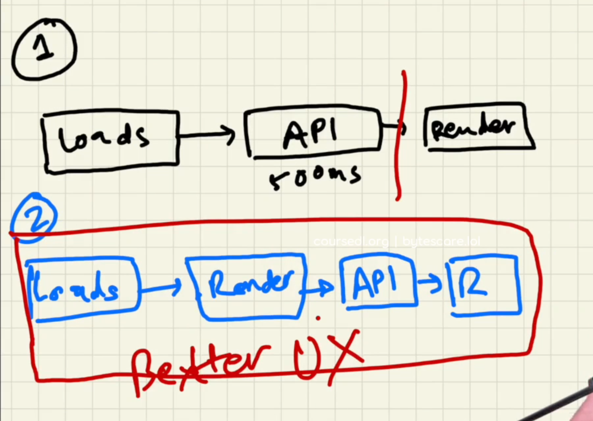

## Monolithic vs Microservice Architecture

### monolithic arch.

- All components of the application are tightly coupled and deployed as a single unit.
- **Advantages**:
  - Easier to develop and test initially due to a single codebase.
- **Disadvantages**:
  - Difficult to scale, deploy, and maintain as the application grows. A change in one part of the application can potentially impact the entire system.
- Example:
  - A restaurant where all food preparation happens in one large kitchen.

### microservices arch.

- The application is broken down into small, independent services that communicate with each other through well-defined APIs.

- **Advantages**:

  - Improved scalability, faster deployments, increased agility, and enhanced resilience. Teams can choose the best technology for each service.

- **Disadvantages**:

  - More complex to design, develop, and manage due to the distributed nature of the system. Requires careful handling of inter-service communication and dependencies.

- Example:
  - Example:
    A food court with various specialized stalls, each serving a different cuisine.

<hr>

## useEffect()

- its a react hook, just like useState().
- **React Hook** : just a normal js **function**
- ## 2 arguments pass in useEffect();

  - **callback fn** & **an array** (dependency)
  - this callback will run after body component load (rendered)

  ```js
  const Body = () => {
    const [restaurantList, setRestaurantList] = useState(restaurantData);

    useEffect(() => {
      console.log("useEffect called"); <--render second
    }, []);

    console.log('body rendered') <----- render first

    return (<div> ........ </div>)

  ```

  - first the body will render, then useEffect()

  - Better approach

    

## fetch()

- is a superpower given by **js engine**
- not react, not js
- fetch returns **PROMISE**

## Shimmer UI :

- React Shimmer is a dynamic and customizable placeholder content solution designed for React and React Native applications

## conditional rendering :

- rendering on the basis of condition

  ```js
  if (restaurantList.length == 0) {
    return <Shimmer />;
  }
  ```

## useState()

```js
const [btnNameReact, setBtnNameReact] = useState("Login");
console.log("header rendered");
```

- how btnNameReact changed despite const keywords
  - because it will rerender and its become new

### note

- whenever local variable of react changes, ui rendered
- whenever state variable update, react triggers a reconcilliation cycle(re-renders the commponent)
